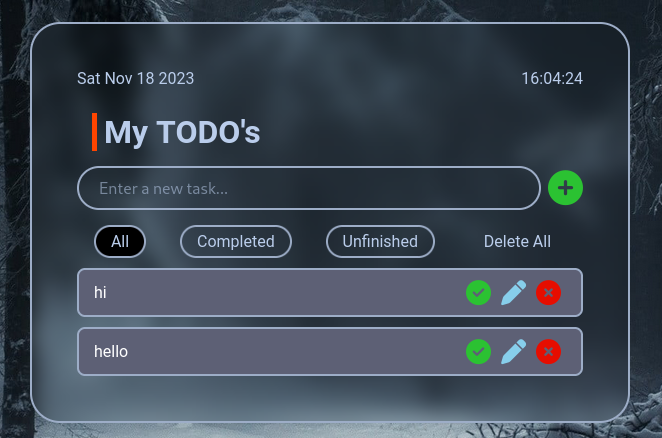
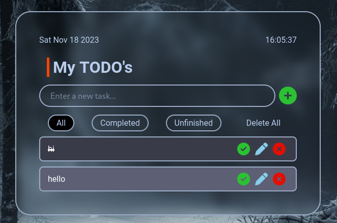
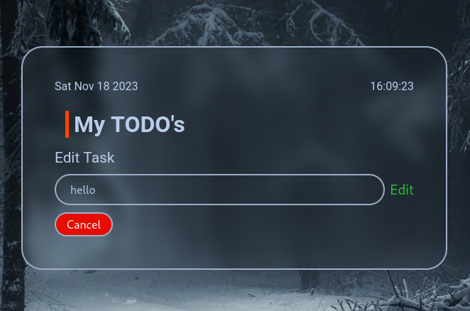
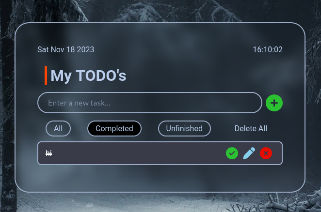
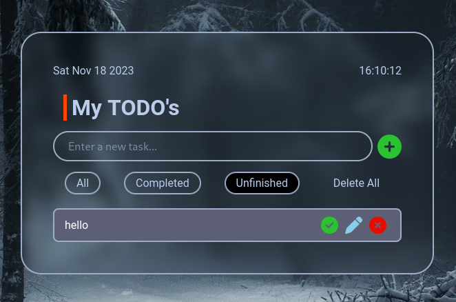

# todo-app
A to-do list app without backend

Written with HTML5, CSS and vanilla JS without a backend server. It can temporarily store, edit, delete and filter your todos base on their status.

## *Features*
**Adding a todo**
- you can add a list of todos to temporarily store in the browser's local storage via the input text field.

     

**Marking a completed todo**
- by clicking the green check button you can mark a completed todo. The todo will be denoted by a crashed out text and a different background color.

    

**Editing a todo**
- you can edit a todo by clicking the edit button represented by a pen image.

    

**Deleting a todo**
- you can delete a todo individually by clicking the red x button in each todo or by clicking the delete all button in the filters to delete all todos.

**Filters**
- todos can be filtered via their statuses- completed or unfinished. The active filter will be denoted by a darker background color.

    
    
    